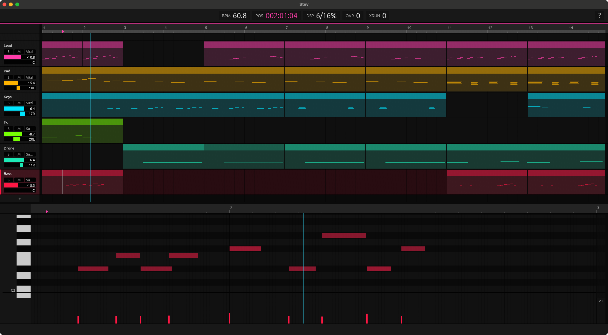

# Stev

**Play freely, and keep what you just played.**

Stev is a capture-first MIDI sequencer for the desktop, written in Rust. It is
always listening: you never have to press record before you play. When
something is worth keeping, one key turns it into a clip, framed and in time,
whether the transport was running or not. Then you loop it, arrange it across
tracks, and play the next part on top.

It is an opinionated app, built around that one workflow, not a general-purpose
DAW. On macOS it hosts CLAP and VST® 3 instrument plugins on each track;
anywhere, it can drive a DAW or external gear over MIDI.

*A* stev *is a short Norwegian folk verse, traditionally improvised.*



> **Status:** 0.1.0, source releases only (no prebuilt app yet). Developed and
> tested on macOS. Linux and Windows build in CI and may work (MIDI Out only, no
> plugin host), but are untested; ports welcome.

## Quickstart

Connect a MIDI keyboard and pick it under **Settings** (`⌘,`, the MIDI tab).
Then:

1. **Play.** Noodle until something sounds right. Nothing needs to be armed.
2. **`\`** commits the take (`/` works too, numpad included). Stopped, Stev
   finds the phrase you just played and makes it a clip, looping; while
   playing, it keeps the last loop pass ([Capture](#capture) has the rest).
   If the phrase came out too long or short, `[` and `]` move the clip's edges
   to the cursor.
3. **`Enter`** fits the tempo to that first clip, so it is a whole number of
   bars. There is no tempo to set up front: your first phrase is the tempo.
4. **`Space`** plays and stops. Play the next part over the loop, on the same
   track or another (`↑` `↓`), and commit again.
5. **`⌘Z`** undoes anything, a commit included.

**`?`** shows every key on one page. On Linux and Windows, `⌘` is `Ctrl`.

## Capture

Stev keeps everything you play on the MIDI input, whether the transport is
running or not, and `\` keeps your latest take. It works the same from the
arranger and from the clip view, stopped or playing. Where the take goes
depends on what is under the cursor on the selected track:

| | Empty space | A clip (or the clip view open on it) |
|---|---|---|
| **Stopped** | Stev finds the phrase you just played and makes it a new clip at the cursor. | The phrase goes into that clip, at the cursor. |
| **Playing** | The last loop pass becomes a new clip at the cursor. | The last loop pass goes into that clip. |

So you can noodle with the transport stopped and keep the phrase you liked,
or play over a running loop and keep the pass that worked, and either way
start a new clip or add to one you already have, such as a second hand on a
piano part. Every capture is one undo step.

The metronome (`K`) clicks with the transport stopped too: a steady pulse at
the project tempo, every beat the same, so you can play to a click before
anything is running. The accent on the first beat of the bar comes back once
the transport runs.

## Getting sound

Stev makes no sound of its own apart from the metronome (`K`). Each track sends
its notes to one of two places:

- **An instrument plugin** (macOS). Open the browser (`⌘⌥B`) and drag a CLAP or
  VST3 instrument from **Plugins** onto a track. `v` opens its editor.
- **MIDI Out**, to a DAW or a hardware synth. Pick the output port under
  **Settings**; each track sends on its own channel, which the chip on its
  header changes. On macOS and Linux, Stev also offers a virtual port,
  `Virtual: Stev`, for routing into other apps without any hardware.

<picture>
  <source media="(prefers-color-scheme: dark)" srcset="docs/images/vst/VST_Compatible_Logo_Steinberg_negative.svg">
  
</picture>

## Not planned

Stev grows toward its capture workflow, not toward a full DAW. These are not on
the roadmap:

- tempo maps and meter changes
- audio tracks and audio recording
- automation lanes and CC lane editing
- effect plugins, sends, a mixer panel
- MIDI clock, Ableton Link or other external sync
- notation
- whole-arrangement MIDI file export and multi-track import (one clip at a time
  each way)
- a richer browser: search, tags, favourites, preview playback
- richer piano-roll editing: a draw mode, paint and erase gestures, drawing
  velocity
- more than 16 tracks, track reordering, track groups
- control-surface or DAW sync (Mackie Control and the like)
- official Linux and Windows support
- VST2, ever: only VST3 and newer formats

Forks that take it somewhere else are welcome.

## Building

```bash
cargo run --release
```

The toolchain is pinned in `rust-toolchain.toml`, so `rustup` fetches the right
version on the first build. On macOS you need the Xcode Command Line Tools; on
Linux, the ALSA headers and `pkg-config` (`libasound2-dev pkg-config` on
Debian/Ubuntu).

## Working on the code

The topic docs under [`docs/`](docs/) cover the threading model, the timing
invariants, the conventions and the reasoning behind them. [`AGENTS.md`](AGENTS.md)
indexes them and sets the ground rules; it is written to be read by people and
coding agents alike (`CLAUDE.md` includes it for Claude Code). For a first
change, [`docs/250-first-feature.md`](docs/250-first-feature.md) follows one key
press from the keyboard to an undoable edit and lists what a feature needs.
[`CONTRIBUTING.md`](CONTRIBUTING.md) says what fits, how to report a bug and
what a pull request is checked against.

## License

Licensed under either of

- Apache License, Version 2.0 ([LICENSE-APACHE](LICENSE-APACHE) or
  <http://www.apache.org/licenses/LICENSE-2.0>)
- MIT license ([LICENSE-MIT](LICENSE-MIT) or <http://opensource.org/licenses/MIT>)

at your option.

### Contribution

Unless you explicitly state otherwise, any contribution intentionally submitted
for inclusion in the work by you, as defined in the Apache-2.0 license, shall be
dual licensed as above, without any additional terms or conditions.

## Trademarks

VST is a registered trademark of Steinberg Media Technologies GmbH. The VST
Compatible logo is used under Steinberg's
[usage guidelines](https://steinbergmedia.github.io/vst3_dev_portal/pages/VST+3+Licensing/Usage+guidelines.html)
(`docs/images/vst/`).
